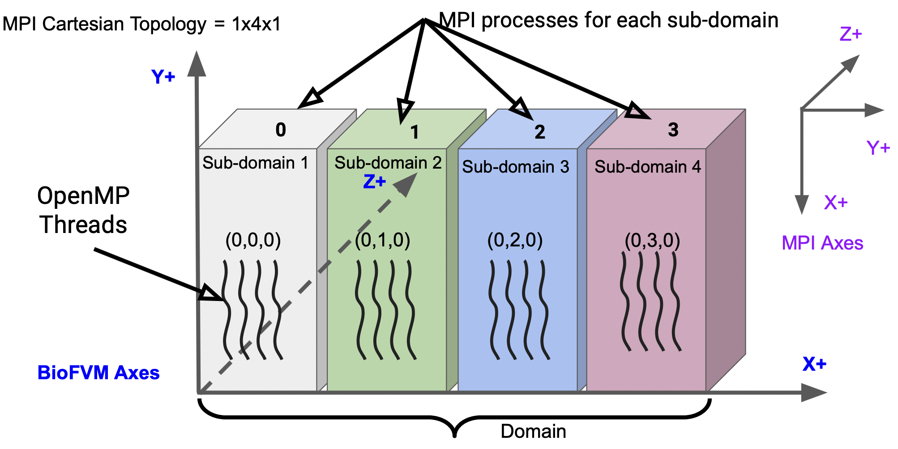

## User Guide (Version 1.14.0)

**PhysiCell-X Project**

Jose-Luis Estragués Muñoz, Gaurav Saxena, Miguel Ponce-de-Leon, Arnau Montagud,David Vicente Dorca and Alfonso Valencia

Revision: _20 February, 2026_


[[_TOC_]]

# Introduction 


PhysiCell-X is the distributed version of PhysiCell [2]. 
PhysiCell is a open-source, multi-physics, multi-scale, agent-based simulator for biological systems. 
It provides both the stage (micro-environment) and actors (cells or agents) for simulation. 
Though PhysiCell is light-weight, flexible and shared-memory parallelized using OpenMP (Open Multiprocessing), it *cannot* run on distributed systems i.e. it cannot be executed on multiple nodes of an HPC (High Performance Computing) cluster. 
Thus, the problem size that PhysiCell can handle is limited by the maximum memory of a single node. 
This is a limitation that needs to be removed and this is where PhysiCell-X comes in.
PhysiCell-X enables the distributed parallelization of PhysiCell by making use of MPI (Message-Passing Interface). In simple words, you can now use multiple nodes of an HPC system to solve a single, coherent problem. 
Thus, the aim of PhysiCell-X is to remove the memory limitation, reduce the time to solution by distributing the computation onto multiple compute nodes and solve very large sized (real-world scale) problems.

## The Current Version

The current version of PhysiCell-X is 1.14.0 and it is based on PhysiCell version 1.14.2. Please note the following very carefully.

-   The User Guide for PhysiCell-X is to be used in conjunction with the User Guide for PhysiCell (till version 1.9.0). The User Guide for PhysiCell contains many details which are *not* reproduced here to avoid unnecessary duplication.

-   PhysiCell-X *only* focuses on 3-D problems and hence distributed parallelism is available *only* for 3-D problems.

-   PhysiCell-X uses MPI for distributed parallelization and OpenMP shared-memory parallelization was already available in PhysiCell. Thus, PhysiCell actually uses hybrid parallelization i.e. MPI + OpenMP.

## Layers in PhysiCell-X

PhysiCell-X can be visualized as being made up of two layers. 
The first layer BioFVM-B [5] solves the diffusion equations of substrates in the micro-environment. 
The second layer is PhysiCell-X itself and takes care of the movement, growth, decay, division, chemical and mechanical interaction and death of cells (agents) etc. BioFVM-B has been released separately and is available at:

1.  [GitHub](https://github.com/bsc-life/BioFVM-B)

The latest version of BioFVM-B also forms part of PhysiCell-X. 


## Parallel Macroscopic Design

### An Analogy

We describe the high level parallel design with the help of a non-technical analogy of a "Partitioned Aquarium". 
Imagine a large aquarium in the shape of a cuboid. It is filled with fish, water, nutrients that we use to feed the fish and everything that you can imagine in an aquarium. 
The aquarium is equivalent to our *3-D domain*.
The fish which can grow, move, die, ingest/secrete nutrients, interact with other fish and so on are equivalent to the *cells* or *agents*. 
The water and the dissolved/undissolved nutrients and other things present are like the *micro-environment*. 
Now, further imagine that we place fictitious partitions in the aquarium which do not let the water/nutrients from one sub-part move to another sub-part but the fish can move from one sub-part to another *adjacent* sub-part through these partitions.
These sub-partitions of the aquarium are equivalent to our sub-domains. 
Thus, the micro-environment in a sub-domain cannot move to the adjacent sub-domain *but* the cells or agents *can* move to *adjacent* sub-domains. 
Further, instead of keeping a single person to manage the aquarium, we hire one person each to manage each of the sub-partitions. 
Each of these persons *independently* manages one sub-partition. 
A person here is equivalent to an *Operating System process* (more specifically an *MPI process*) and the sub-partition is equivalent to a sub-domain. 
To take things further, each of these persons can hire additional people under them to manage the sub-partition.
These *additional* people are like *OpenMP threads* which run within an MPI process.

### Domain Partitioning

Figure [\[fig:domain\_partitioning\]](#fig:domain_partitioning){reference-type="ref" reference="fig:domain_partitioning"} formally illustrates the aforementioned analogy. 
It shows a 3-D domain and the directions of the axes. 
The domain is divided in the X-direction *only* among the MPI processes i.e. the 3-D domain is partitioned in a single dimension only (1-D domain partitioning - imagine slices of a bread). 
It is important to note that the direction of the axes of BioFVM-B/PhysiCell-X is different from the directions of the axes of MPI Cartesian Topology $^2$.
In this specific case, the whole 3-D domain is partitioned among 4 MPI processes (shown in gray, green, blue and red). This Cartesian Topology is $1 \times 4 \times 1$, indicating that we have 1 MPI process in the X-direction, 4 in the Y-direction and 1 in the Z-direction. 
Please note we have 4 processes in the Y-direction of the MPI Cartesian Topology because *the X-axis of BioFVM-B/PhysiCell-X is equivalent to the Y-axis of the MPI Topology*. 
Each of these sub-partitions (formally called sub-domains) can be located with the help of MPI Cartesian coordinates.
Process 0 (formally called Rank 0) has coordinates $(0,0,0)$, process 1 (Rank 1) has $(0,1,0)$, process 2 (Rank 2) has $(0,2,0)$ and process 4 (Rank 3) has coordinates $(0,3,0)$. 
Within each sub-domain managed by a single MPI process, the wavy, dark, solid lines indicate OpenMP threads.

### Mapping to Hardware (To be revised)

Each sub-domain has a different and independent micro-environment which
is managed by a single MPI process. Multiple OpenMP threads can exist
within each MPI process. *Typically*, to obtain a good performance from
PhysiCell-X, one would run a single MPI process per socket and one
OpenMP thread per core. For example, if a node of an HPC cluster
consists of 2 sockets and each socket has 24 cores then we *typically*
would run 2 MPI processes per node i.e. one MPI process per socket and
then run 24 OpenMP threads per socket i.e. one OpenMP thread per
hardware core. Please note that this is *not* a rule and sometimes we
also run 1 MPI process per node and 48 OpenMP threads per MPI process.



## Prerequisites


PhysiCell-X is completely written in C++ and uses MPI + OpenMP for
distributed-shared memory parallelization. There is no need for a
package manager and can be installed using Makefiles. Thus there are two
prerequisites:

1.  A C++ compiler with a support for OpenMP for e.g., the GCC g++
    compiler, the Intel C++, or Apple clang compiler etc.

2.  An MPI implementation for e.g., OpenMPI, MPICH, Mvapich2, Intel MPI,
    IBM Spectrum MPI or others.

Please see the original User documentation of PhysiCell for instructions
on how to install on OSX (MacOS) and Virtual Machine (like VirtualBox).
Some MATLAB scripts for plotting are bundled with PhysiCell/PhysiCell-X
which can be executed in MATLAB or *possibly*
[Octave](https://www.gnu.org/software/octave/). We also recommend
installing [ImageMagick](http://imagemagick.org) which is useful for
converting SVG images to PNG, JPEG or creating a movie from SVG files.

> **📝 IMPORTANT**

> We have tested the parallelized examples extensively using GCC 13.2.0 compiler and OpenMPI 4.1.5 and Marenostrum 5 supercomputer.

# MPI processes, Voxels and Divisibility

The 3-D simulation domain in PhysiCell-X is divided into Voxels
(Volumetric Pixels). Voxels generally are cubic (but they can be a
cuboid as well). Thus, for example if the domain length in the X, Y and
Z direction is \[-500,+500\], \[-500,+500\] and \[-500,+500\],
respectively and the Voxel (cubic) dimension is 20, then we have
$\frac{500 - (-500)}{20} = \frac{1000}{20}=50$ voxels *each* in the X, Y
and Z-directions. As described in the previous section, PhysiCell-X
implements 1-D domain partitioning in the X-direction. Because of this, tissues that are not homogeneously distributed across the domain can create workload imbalances for the simulation engine, for example when simulating a spheroid. 

There is no restriction on the number of OpenMP threads within a single MPI process.
Further, there are two types of meshes in PhysiCell (or PhysiCell-X)
i.e. a *diffusion mesh* and a *mechanical mesh*. The size of the voxels
for *each* of these meshes is defined separately.

> **📝 IMPORTANT**
> 1.  Load unbalances between MPI processes can be caused by the topology of the tissue.  
> 2.  Size of Diffusion voxel must be $\leq$ size of Mechanical voxel.
> 3.  All MPI processes must contain at least 1 cell. 

# Code-base organization 

Inside the parent directory of PhysiCell-X, there are multiple
directories. Some directories which users would frequently need to deal
with are:

-   `config:` This directory is used for providing the inputs to the application. We use a file named `PhysiCell_settings.xml` to provide *most* of the input parameters. We say *most* because certain behaviours can be hardwired within the project.

-   `custom_modules:` This directory is where the custom code created by the user is put that is specific to an example that the user is working with. *Typically*, the file is named `PhysiCell_custom.cpp` and `PhysiCell_custom.h`.

-   `sample_projects` *and* `sample_projects_intracellular:` These     directories includes sample projects that can be used as a starting point to create your own example. Users can *check-out* a project from these directories into the *working* directories and work with the copy of the checked-out code. The strategy of working with a *copy* of the code prevents any accidental/unwanted changes into the original code. Once the user is satisfied with the *working copy*, this can be checked back into the `sample_projects` or `sample_projects_intracellular` master code.

There are multiple other directories which *typically* a user will not need to interact with. Some directories are:

1.  `BioFVM:` This includes a working copy of the BioFVM/BioFVM-B multi-substrate diffusion code [2; ]. BioFVM distributions also include pugixml (an efficient cross-platform XML parser) [3].

2.  `core:` contains the core library files for PhysiCell/PhysiCell-X. The `modules` directory also contains some core files. In the future the developers plan to remove the `modules` directory.

3.  `matlab` This includes basic Matlab files for handling PhysiCell outputs. These can be used to visualize the output data.

> **📝 IMPORTANT: Note on the parallel code**:

> Whenever the parallel equivalent of a serial function is available, it is written immediately below the corresponding serial function in the same source file.


# Running an Example

After downloading PhysiCell-X, go to the parent/top-level
directory/folder. As of now, there are three examples that are hybrid
parallelized (MPI+OpenMP). These are:

1.  `sample_projects/pred_prey_mpi`: This is a classic Predator-Prey project in 3-D.

2.  `sample_projects/heterogeneity_mpi`: simulates a 3-D tumor with heterogeneous "genetics" that drive differential proliferation [2] (text reproduced from the original PhysiCell User Guide but instead of a 2-D tumor, we now have a 3-D tumor).

3.  `sample_projects_intracellular/boolean/spheroid_tnf_model_mpi`: This is a paralleized example in 3-D which makes use of PhysiBoss (bundled with PhysiCell v1.9.0/PhysiCell-X v0.1) to simulate the Tumor Necrosis Factor (TNF) simulation.

The first step is to *check-out/populate* a project. Checking
out/populating means *copying* a project and working files from the
project directory into the working directory. Thus, as mentioned before,
working with a copy of the projects prevents the original copy from
being modified. This also has the *disadvantage* that modified files
need to be copied to the original project directories if you are
satisfied with the experiment and changes. To populate a project:

    make [project_name]

where the `project_name` is one of the following three:

1.  `pred-prey-mpi`

2.  `heterogeneity-sample-mpi`

3.  `physiboss-tnf-model-mpi`

> **📝 IMPORTANT: Note on the `make` function**: 
> 1.  To see all sample projects type `make list-projects`. The name of the project can be different from the name of the directory under which it is stored. Name of the project *typically* contains *hyphens* whereas the project directory name contains *underscores*.
> 2.  To clear object files, executable files of a project type `make clean`.
> 3.  To reset the PhysiCell-X to the original (or clean) state type `make reset` (remember to copy any modified file *into* the appropriate project before you execute this command and also remove any unwanted remaining files in the `config` directory !)

Checking-out a project will first:

1.  Replace the `Makefile` in the parent directory with the *project-specific* `Makfile`

2.  Copy the `main.cpp` (file name may vary with project but this file would contain the C++ `main()` function) of the project to the working parent directory.

3.  Copy the *project-specific* files in the `custom_modules` directory in the `custom_modules` directory under the parent directory.

4.  Copy the project specific files in the `config` directory to `config` under the parent directory.

**📝 IMPORTANT: Note on `PhysiCell settings.xml`**:
There can be multiple `PhysiCell_settings_.xml` file inside the `config` directory. *Typically* it is the plain, simple file named `PhysiCell_settings.xml` that the user can start with.

As an example, assume that the parent directory of PhysiCell-X is `PhysiCell-X` and we need to check-out the `pred-prey-mpi` project inside the `sample_projects` directory. On executing

    make pred-prey-mpi

the following happens:

1.  Copy file `PhysiCell-X/sample_projects/pred_prey_mpi/Makefile` to `PhysiCell-X/Makefile`.

2.  Copy file `PhysiCell-X/sample_projects/pred_prey_mpi/main.cpp` to `Physicell-X/main.cpp`

3.  Copy directory `Physicell-X/sample_projects/pred_prey_mpi/custom_modules` to `PhysiCell-X/custom_modules`

4.  Copy directory `Physicell-X/sample_projects/pred_prey_mpi/config` to `PhysiCell-X/config`.

Now, the user can modify `PhysiCell-X/main.cpp`, `PhysiCell-X/Makefile` and the source code files in `PhysiCell-X/custom_modules`.

Once the user has modified the files (or just wants to run an unmodified example) the project is *built* by typing:

    make

As an example, when we run `make` *after* checking out the project named `spheroid_tnf_model_mpi`, it produces an executable named `physiboss-tnf-model-mpi`. 
The name of the executable can be changed by changing the variable named `PROGRAM_NAME` in the `Makefile`.

The following is a sample output that is produced *after* checking out the `physiboss-tnf-model-mpi` project (`make physiboss-tnf-model-mpi`) and *after* executing `make`.

    python3 beta/setup_libmaboss.py
    operating system =  Linux
    libMaBoSS will now be installed into the addon PhysiBoSS addon folder:
    addons/PhysiBoSS

    Beginning download of libMaBoSS into addons/PhysiBoSS ...
    http://maboss.curie.fr/pub/libMaBoSS-linux64.tar.gz
    my_file =  addons/PhysiBoSS/libMaBoSS-linux64.tar.gz
    100.1% 2113536 / 2112151
    installing (uncompressing) the file...
    Done.

    mpic++ -march=native  -O3 -fomit-frame-pointer -mfpmath=both -fopenmp -m64 -std=c++11 -g  -c ./BioFVM/BioFVM_vector.cpp 
    mpic++ -march=native  -O3 -fomit-frame-pointer -mfpmath=both -fopenmp -m64 -std=c++11 -g  -c ./BioFVM/BioFVM_mesh.cpp 
    mpic++ -march=native  -O3 -fomit-frame-pointer -mfpmath=both -fopenmp -m64 -std=c++11 -g  -c ./BioFVM/BioFVM_microenvironment.cpp 
    mpic++ -march=native  -O3 -fomit-frame-pointer -mfpmath=both -fopenmp -m64 -std=c++11 -g  -c ./BioFVM/BioFVM_solvers.cpp 
    mpic++ -march=native  -O3 -fomit-frame-pointer -mfpmath=both -fopenmp -m64 -std=c++11 -g  -c ./BioFVM/BioFVM_matlab.cpp
    mpic++ -march=native  -O3 -fomit-frame-pointer -mfpmath=both -fopenmp -m64 -std=c++11 -g  -c ./BioFVM/BioFVM_utilities.cpp 
    mpic++ -march=native  -O3 -fomit-frame-pointer -mfpmath=both -fopenmp -m64 -std=c++11 -g  -c ./BioFVM/BioFVM_basic_agent.cpp 
    mpic++ -march=native  -O3 -fomit-frame-pointer -mfpmath=both -fopenmp -m64 -std=c++11 -g  -c ./BioFVM/BioFVM_MultiCellDS.cpp
    mpic++ -march=native  -O3 -fomit-frame-pointer -mfpmath=both -fopenmp -m64 -std=c++11 -g  -c ./BioFVM/BioFVM_agent_container.cpp 
    mpic++ -march=native  -O3 -fomit-frame-pointer -mfpmath=both -fopenmp -m64 -std=c++11 -g  -c ./BioFVM/pugixml.cpp
    mpic++ -march=native  -O3 -fomit-frame-pointer -mfpmath=both -fopenmp -m64 -std=c++11 -g  -c ./core/PhysiCell_phenotype.cpp
    mpic++ -march=native  -O3 -fomit-frame-pointer -mfpmath=both -fopenmp -m64 -std=c++11 -g  -c ./core/PhysiCell_cell_container.cpp 
    mpic++ -march=native  -O3 -fomit-frame-pointer -mfpmath=both -fopenmp -m64 -std=c++11 -g  -c ./core/PhysiCell_standard_models.cpp 
    mpic++ -march=native  -O3 -fomit-frame-pointer -mfpmath=both -fopenmp -m64 -std=c++11 -g  
    -DADDON_PHYSIBOSS -I/gpfs/home/bsc99/bsc99102/GS_PhysiCell_X/addons/PhysiBoSS/MaBoSS-env-2.0/engine/include -DMAXNODES=64 -c ./core/PhysiCell_cell.cpp
    mpic++ -march=native  -O3 -fomit-frame-pointer -mfpmath=both -fopenmp -m64 -std=c++11 -g  -c ./core/PhysiCell_custom.cpp 
    mpic++ -march=native  -O3 -fomit-frame-pointer -mfpmath=both -fopenmp -m64 -std=c++11 -g  -c ./core/PhysiCell_utilities.cpp 
    mpic++ -march=native  -O3 -fomit-frame-pointer -mfpmath=both -fopenmp -m64 -std=c++11 -g  -c ./core/PhysiCell_constants.cpp
    mpic++ -march=native  -O3 -fomit-frame-pointer -mfpmath=both -fopenmp -m64 -std=c++11 -g  -c ./modules/PhysiCell_SVG.cpp
    mpic++ -march=native  -O3 -fomit-frame-pointer -mfpmath=both -fopenmp -m64 -std=c++11 -g  -c ./modules/PhysiCell_pathology.cpp
    mpic++ -march=native  -O3 -fomit-frame-pointer -mfpmath=both -fopenmp -m64 -std=c++11 -g  -c ./modules/PhysiCell_MultiCellDS.cpp
    mpic++ -march=native  -O3 -fomit-frame-pointer -mfpmath=both -fopenmp -m64 -std=c++11 -g  -c ./modules/PhysiCell_various_outputs.cpp
    mpic++ -march=native  -O3 -fomit-frame-pointer -mfpmath=both -fopenmp -m64 -std=c++11 -g  -c ./modules/PhysiCell_pugixml.cpp
    mpic++ -march=native  -O3 -fomit-frame-pointer -mfpmath=both -fopenmp -m64 -std=c++11 -g   -c ./modules/PhysiCell_settings.cpp  
    mpic++ -march=native  -O3 -fomit-frame-pointer -mfpmath=both -fopenmp -m64 -std=c++11 -g  -c ./DistPhy/DistPhy_Environment.cpp
    mpic++ -march=native  -O3 -fomit-frame-pointer -mfpmath=both -fopenmp -m64 -std=c++11 -g  -c ./DistPhy/DistPhy_Cartesian.cpp
    mpic++ -march=native  -O3 -fomit-frame-pointer -mfpmath=both -fopenmp -m64 -std=c++11 -g  -c ./DistPhy/DistPhy_Utils.cpp
    mpic++ -march=native  -O3 -fomit-frame-pointer -mfpmath=both -fopenmp -m64 -std=c++11 -g  -c ./DistPhy/DistPhy_Collective.cpp
    mpic++ -march=native  -O3 -fomit-frame-pointer -mfpmath=both -fopenmp -m64 -std=c++11 -g  
    -DADDON_PHYSIBOSS -I/gpfs/home/bsc99/bsc99102/GS_PhysiCell_X/addons/PhysiBoSS/MaBoSS-env-2.0/engine/include -DMAXNODES=64  -c ./custom_modules/custom.cpp
    mpic++ -march=native  -O3 -fomit-frame-pointer -mfpmath=both -fopenmp -m64 -std=c++11 -g  
    -DADDON_PHYSIBOSS -I/gpfs/home/bsc99/bsc99102/GS_PhysiCell_X/addons/PhysiBoSS/MaBoSS-env-2.0/engine/include -DMAXNODES=64 -c ./custom_modules/submodel_data_structures.cpp
    mpic++ -march=native  -O3 -fomit-frame-pointer -mfpmath=both -fopenmp -m64 -std=c++11 -g  
    -DADDON_PHYSIBOSS -I/gpfs/home/bsc99/bsc99102/GS_PhysiCell_X/addons/PhysiBoSS/MaBoSS-env-2.0/engine/include -DMAXNODES=64 -c ./custom_modules/tnf_receptor_dynamics.cpp
    mpic++ -march=native  -O3 -fomit-frame-pointer -mfpmath=both -fopenmp -m64 -std=c++11 -g  
    -DADDON_PHYSIBOSS -I/gpfs/home/bsc99/bsc99102/GS_PhysiCell_X/addons/PhysiBoSS/MaBoSS-env-2.0/engine/include -DMAXNODES=64 -c ./custom_modules/tnf_boolean_model_interface.cpp
    compiling
    mpic++ -march=native  -O3 -fomit-frame-pointer -mfpmath=both -fopenmp -m64 -std=c++11 -g  
    -DADDON_PHYSIBOSS -I/gpfs/home/bsc99/bsc99102/GS_PhysiCell_X/addons/PhysiBoSS/MaBoSS-env-2.0/engine/include -DMAXNODES=64 -c ./addons/PhysiBoSS/src/maboss_network.cpp
    mpic++ -march=native  -O3 -fomit-frame-pointer -mfpmath=both -fopenmp -m64 -std=c++11 -g  
    -DADDON_PHYSIBOSS -I/gpfs/home/bsc99/bsc99102/GS_PhysiCell_X/addons/PhysiBoSS/MaBoSS-env-2.0/engine/include -DMAXNODES=64 -c ./addons/PhysiBoSS/src/maboss_intracellular.cpp

    mpic++ -march=native  -O3 -fomit-frame-pointer -mfpmath=both -fopenmp -m64 -std=c++11 -g  
    -DADDON_PHYSIBOSS -I/gpfs/home/bsc99/bsc99102/GS_PhysiCell_X/addons/PhysiBoSS/MaBoSS-env-2.0/engine/include -DMAXNODES=64  
    -o spheroid_TNF_model_mpi BioFVM_vector.o BioFVM_mesh.o BioFVM_microenvironment.o BioFVM_solvers.o BioFVM_matlab.o 
    BioFVM_utilities.o BioFVM_basic_agent.o BioFVM_MultiCellDS.o BioFVM_agent_container.o   pugixml.o PhysiCell_phenotype.o 
    PhysiCell_cell_container.o PhysiCell_standard_models.o PhysiCell_cell.o PhysiCell_custom.o PhysiCell_utilities.o 
    PhysiCell_constants.o PhysiCell_SVG.o PhysiCell_pathology.o PhysiCell_MultiCellDS.o PhysiCell_various_outputs.o 
    PhysiCell_pugixml.o PhysiCell_settings.o DistPhy_Environment.o DistPhy_Cartesian.o DistPhy_Utils.o DistPhy_Collective.o 
    custom.o submodel_data_structures.o tnf_receptor_dynamics.o tnf_boolean_model_interface.o maboss_network.o 
    maboss_intracellular.o   main.cpp -L/gpfs/home/bsc99/bsc99102/GS_PhysiCell_X/addons/PhysiBoSS/MaBoSS-env-2.0/engine/lib -lMaBoSS-static -ldl

    check for spheroid_TNF_model_mpi


An important point to note from the compilation output above is that `libMaBoss` is *downloaded* and installed from the command line. 
Thus, the machine that this compilation is done on will need *access to the Internet*. This is *not* the case for examples that *do not* need PhysiBoss. 
By default, everytime when a `make clean` is performed, it *also* deletes the `libMaBoss` library. 
To prevent this from happening, we need to modify the `Makefile` by *not* calling the `MaBoSS-clean` action when a `make clean` is performed. To be precise, we need to delete the `MaBoSS-clean` from the `clean` rule (see the following code snippet from the `Makefile`).

    clean: MaBoSS-clean #<---Delete this MaBoss-clean
        rm -f *.o
        rm -f $(PROGRAM_NAME)*

> **📝 IMPORTANT: Note on libMaBoss library**

> It is only downloaded the very first time but subsequently its deletion & download can be prevented by modifying the `clean` rule in the `Makefile` as shown above.

To run the executable produced above i.e. `spheroid_TNF_model_mpi` above in parallel (MPI + OpenMP) on an HPC system/cluster, we *typically* use a submission script written in the Unix shell script language. 
This does *not* mean that the program cannot run on a Laptop, Desktop etc. but the syntax for execution varies (and most certainly the performance gains are smaller). 
We show below a submission script for the SLURM workload manager for HPC systems and explain every line of the script.
```bash
    #!/bin/bash

    #SBATCH --job-name="TNF_Simulation"
    #SBATCH --nodes=150
    #SBATCH --ntasks-per-node=1
    #SBATCH --cpus-per-task=48
    #SBATCH -t 72:00:00
    #SBATCH -o output-%j
    #SBATCH -e error-%j
    #SBATCH --exclusive

    export OMP_DISPLAY_ENV=true
    export OMP_SCHEDULE=STATIC
    export OMP_NUM_THREADS=$SLURM_CPUS_PER_TASK
    export OMP_PROC_BIND=spread
    export OMP_PLACES=threads

    mpiexec ./spheroid_TNF_model_mpi    
```
We assume that the script above is saved as `script_tnf_mpi.sh`. 
The following describes (almost) every line:

1.  Line 1 means that this script is to be executed using the Linux `bash` shell.

2.  Line 2 gives a name to this job - in this case "TNF\_simulation".

3.  Line 3 means assign 150 HPC nodes to this job. (In our experiments we use HPC nodes which have 48 cores. These 48 cores are distributed as 2 sockets of 24 cores each.)

4.  Line 4 states that we only need 1 MPI process per node. This means we will only have 150 MPI processes (= the number of HPC nodes requested).

5.  Line 5 says that 48 OpenMP threads should be spawned per MPI process. Each of these threads will "cling" (or technically bind) to a core (remember we have 48 cores and 48 threads). Thus, the total number of cores being used in this job are: $150 \times 48 = 7200$ i.e. 150 MPI processes times 48 OpenMP threads.

6.  Line 6 means that this job can execute for a maximum of 72 hours.

7.  Line 7 says that the output of the job should be written to a file named `output-[jobid]`, where `jobid` is a unique number that is provided by SLURM.

8.  Line 8 says exactly the same thing as Line 7 but about the error file.

9.  Line 9 requests "exclusive" nodes for our job i.e. no other user's job can be run in the nodes allocated to our job while our job is running. This is very important for performance.

10. Line 10 directs the OpenMP thread binding details and environment variable values to be printed in the error file.

11. Line 11 fixes the "static" schedule for the OpenMP parallel `for` loops (when they are executed).

12. Line 12 says that the number of OpenMP threads which are spawned should be equal to the value of the SLURM variable `SLURM_CPUS_PER_TASK`, which in this case is 48.

13. Line 13 tells the OpenMP environment that threads should be placed as far apart from each other as possible. In this case it does not matter as we have 48 threads and 48 cores i.e. the whole node is *completely* filled with one thread per core.

14. Line 14 tells the OpenMP threads to bind to "threads". Our HPC node runs only one thread per core (no hyper-threading) and hence the option "threads" in this case translates to "cores".

15. Line 15 finally executes the program. through `mpiexec` - the MPI launch command.

The script above *may* not fetch us the best performance. 
In HPC, the software *must* map to the underlying hardware in order to extract maximal performance. 
Thus, to continue this discussion, we present another script next that gives better performance on our systems. 
The reader may recollect that our experiments are performed on HPC nodes having 48 cores each and organized as 2 sockets of 24 cores each. 
Our aim is to spawn 1 MPI process per socket and 24 threads per MPI process to bind to the 24 cores in each socket. 
This reduces *false sharing* between OpenMP threads - a topic which is beyond the scope of the document but can be found easily by consulting any book on OpenMP. 
The script is very similar to the script presented previously and is shown below:
```bash
    #!/bin/bash

    #SBATCH --job-name="TNF_Simulation"
    #SBATCH --nodes=150
    #SBATCH --ntasks-per-node=2
    #SBATCH --cpus-per-task=24
    #SBATCH -t 72:00:00
    #SBATCH -o output-%j
    #SBATCH -e error-%j
    #SBATCH --exclusive

    export OMP_DISPLAY_ENV=true
    export OMP_SCHEDULE=STATIC
    export OMP_NUM_THREADS=$SLURM_CPUS_PER_TASK
    export OMP_PROC_BIND=spread
    export OMP_PLACES=threads 

    mpiexec --map-by ppr:1:socket:pe=24 ./spheroid_TNF_model_mpi
```

The difference in this script from the previous script is that we are creating 2 MPI processes per node (or 1 MPI process per socket and we have 2 sockets in one node). 
Further, we are now spawning 24 OpenMP threads per MPI process. The *total* number of threads in this script and the previous script are exactly the same i.e. 7200 threads (with one thread per core). 
Thus, the total number of cores that we use in both the scripts are 7200. 
The second script maps the MPI processes more properly to the internal architecture of the node as the node consist of 2 sockets. 
The other difference is the `–map-by ppr` syntax. `ppr` stands for processes per resource and here we have 1 MPI process per socket (indicated by the `:socket` in the `mpiexec` statement). 
Further, the number of *processing elements* (given by `pe` in the `mpiexec` statement) are 24 in each *resource*. 
The processing elements are equivalent to our cores. 
Thus, in a nutshell the `mpiexec` statement indicates the hardware resources i.e. sockets and cores and the overall script maps the MPI processes to sockets and the OpenMP threads to cores. 
The user is encouraged to experiment with both the scripts (or modify the values of the variables in the script to cater to his/her machine's architecture) and to observe the difference in performance.

## Running the TNF MPI example

We now detail out how to run the TNF MPI example. We assume that the
project is in a clean state i.e. PhysiCell-X is just downloaded/cloned.
The first step is to see the projects which are available using

    make list-projects

. We must now choose to check-out the TNF MPI project using

    make physiboss-tnf-model-mpi

This performs the following actions (as explained above):
```bash
    cp ./sample_projects_intracellular/boolean/spheroid_tnf_model_mpi/custom_modules/* 
    ./custom_modules/
    touch main.cpp && cp main.cpp main-backup.cpp
    cp ./sample_projects_intracellular/boolean/spheroid_tnf_model_mpi/main-spheroid_TNF.cpp 
    ./main.cpp 
    cp Makefile Makefile-backup
    cp ./sample_projects_intracellular/boolean/spheroid_tnf_model_mpi/Makefile .
    cp ./config/PhysiCell_settings.xml ./config/PhysiCell_settings-backup.xml 
    cp ./sample_projects_intracellular/boolean/spheroid_tnf_model_mpi/config/* ./config/
```
At this point please make sure that you have a C++ compiler (like GCC)
and MPI implementation (like OpenMPI) configured properly. We next
compile this checked-out project by simply executing

    make

. If the compilation is successful, users should see an executable named
`spheroid_TNF_model_mpi`. There are several submission script files
provided in the top level directory and in this example we use the
submission script named `script_physiboss_tnf_model_mpi.sh`. The user is
encouraged to open this file using a text editor and understand the
parameters (as explained in the section above) so that even if a job
manager like SLURM or PBS is not available, he/she is able to translate
the parameters to execute it on the local system. If the SLURM system is
available (like on the Marenostrum supercomputer), this job can simply
be submitted (and subsequently executed) using

    sbatch script_physiboss_tnf_model_mpi.sh

. However before submitting this job for running, it is better to check
and understand some parameters. We start with the submission script
itself and explain sequence which should be followed to perform a basic
quick check of the requirements. In the submisssion script, the line
```bash
mpiexec --map-by ppr:1:socket:pe=24  --report-bindings ./spheroid_TNF_model_mpi
```
indicates that we do *not* input any special settings file to the
executable program `spheroid_TNF_model_mpi`. If you want to input any
special settings file, say `PhysiCell_settings_my_file.xml` then this
must be given after the name of the executable. Thus, we are using the
default `PhysiCell_settings.xml` file in the `config` directory. If we
open the `Physicell_settings.xml` file, we see the domain dimensions in the bery beginning of the file as:
```xml
    <domain>
            <x_min>-200</x_min>
            <x_max>200</x_max>
            <y_min>-200</y_min>
            <y_max>200</y_max>
            <z_min>-200</z_min>
            <z_max>200</z_max>
            <dx>20</dx>
            <dy>20</dy>
            <dz>20</dz>
            <use_2D>false</use_2D>
        </domain>    
```

First, this shows that domain dimensions in the X/Y and Z direction vary
from $[-200,+200]$ i.e. $400$ units of length. Second, the length/width
and height of the *diffusion* voxel is $20$. Please note that the
length/breadth/height of the *mechanical* voxel is specified through the
`main.cpp` of the specific project. Further, since PhysiCell-X works
*only* for 3-D problems, the 2-D settings are set to `false`. The total
number of diffusion voxels in this case in the X, Y and Z directions are
$\frac{200-(-200)}{20} = \frac{400}{20} = 20$ each. If we check in the
`script_physiboss_tnf_model_mpi.sh` file, we can see that the total
number of MPI processes are only *two* i.e. we have a single node with 2
MPI processes per node as indicated by the lines below:
```bash
    #SBATCH --nodes=1
    #SBATCH --ntasks-per-node=2
```

One of the conditions that must be fulfilled is that the total number of
diffusion (or mechanical) voxels in the X-direction *must* be
*completely/exactly/perfectly* divisible by the total number of MPI
processes. In this case, we have a total of 20 diffusion voxels and 2
MPI processes and we can see that $\frac{20}{2} = 10$ gives 10
*diffusion* voxels per MPI process. This divisibility condition is not
needed in the Y/Z directions as we only implement a 1-dimensional
X-direction decomposition. At this stage it is very important to check
the size of the mechanical voxel in the `main.cpp` file in the top level
directory and the following line in this file shows that the size of the
mechanical voxel is also set to 20 (i.e. the same as the size of the
diffusion voxel):

    double mechanics_voxel_size = 20;

It is clear that the total number of mechanical voxels in the X-direction i.e. $\frac{200-(-200)}{20}=20$ are also divisible by the
total number of MPI processes (2 in this case). Thus, we have checked
that

1.  Mechanical voxel size $\geq$ Diffusion voxel size.

2.  Total number of voxels (both Mechanical and Diffusion) in the X-direction are perfectly divisible by the total number of MPI processes.

The `PhysiCell_settings.xml` file also indicates that the total number
of OpenMP threads is just one i.e.
```xml
    <parallel>
            <omp_num_threads>1</omp_num_threads>
    </parallel>     
```
This has no effect on our program *because* we have commented out the
line in `main.cpp` that sets the number of OpenMP threads to the value
above i.e. just one OpenMP thread. See the line below in `main.cpp`.
```bash
//omp_set_num_threads(PhysiCell_settings.omp_num_threads); <--- We use OMP_NUM_THREADS
```
Instead of setting the number of OpenMP threads using this XML
parameter, we use the `OMP_NUM_THREADS` environment variable as given in
`script_physiboss_tnf_model_mpi.sh`. In this file, we simply set this
environment variable as shown below:
```bash
    export OMP_NUM_THREADS=$SLURM_CPUS_PER_TASK
```

where the environment variable `SLURM_CPUS_PER_TASK` indicate the number
of OpenMP threads (SLURM terminology is not intuitive !). This variable
is set as (see `script_physiboss_tnf_model_mpi.sh`):
```bash
    #SBATCH --cpus-per-task=24
```
Here, the environment variable `SLURM_CPUS_PER_TASK` takes its value
from the `–cpus-per-task=24` SLURM option. Thus, the number of OpenMP
threads in our program is 24 per socket (and $2 \times 24 = 48$ per
node).\
The initial part of the `main.cpp` contains the lines of code to build a
Cartesian topology. It can be noted that *this part of the code will
remain exactly the same for all the parallel programs*. Thus, the user
can simply copy and paste this code into any new programs that they
make. We show this part of the code below:
```
/*=======================================================================================*/
/* Create mpi_Environment object, initialize it, then create Cartesian Topology          */
/*=======================================================================================*/
    
    mpi_Environment world;                         
    world.Initialize();                            
    mpi_Cartesian cart_topo;                       
    cart_topo.Build_Cartesian_Topology(world);      
    cart_topo.Find_Cartesian_Coordinates(world);   
    cart_topo.Find_Left_Right_Neighbours(world); 
    /* Other code goes here */
    ...
    ...
    /* Other code ends */
    world.Finalize(); 
    return 0;
```

If you not familiar with parallel programming and this appears strange
to you, then we strongly suggest *not* devoting time to understanding
this piece of the code as this code is repeated as it for *all* the
programs. However, we encourage the user to check out the `DistPhy`
directory and the `.h` files under it to get an idea of what data
members and functions the classes `mpi_Environment` and `mpi_Cartesian`
contain. We could as developers have abstracted away some of the calls
above but we prefer to let the user know (to an extent) the parallel
calls that are being executed behind the scenes.\
After compilation using `make`, we can now submit the code using

```shell
sbatch script_physiboss_tnf_model_mpi.sh
```

. If everything goes well (fingers crossed !), we should see an output
like:
```

     ____   _               _  _____     _ _     __   __                     _                    ___  __  
    |  __ \| |             (_)/ ____|   | | |    \ \ / /                    (_)                  / _ \/_ |
    | |__) | |__  _   _ ___ _| |     ___| | |_____\ V /  __   _____ _ __ ___ _  ___  _ __ ______| | | || |
    |  ___/| '_ \| | | / __| | |    / _ \ | |______> <   \ \ / / _ \ '__/ __| |/ _ \| '_ \______| | | || |
    | |    | | | | |_| \__ \ | |___|  __/ | |     / . \   \ V /  __/ |  \__ \ | (_) | | | |     | |_| || |
    |_|    |_| |_|\__, |___/_|\_____\___|_|_|    /_/ \_\   \_/ \___|_|  |___/_|\___/|_| |_|      \___(_)_|
                   __/ |                                                                                  
                  |___/                                                                              
Using config file ./config/PhysiCell_settings.xml ... 
1
dc? 1
User parameters in XML config file: 
Bool parameters:: 
update_pc_parameters_O2_based: 0 [dimensionless]

Int parameters:: 
random_seed: 0 [dimensionless]
time_add_tnf: 50 [min]
duration_add_tnf: 10 [min]
time_remove_tnf: 100000 [min]
membrane_length: 170 [dimensionless]

Double parameters:: 
concentration_tnf: 0.05 [TNF/um^3]

String parameters:: 
init_cells_filename: ./config/init_5k.txt [dimensionless]


which boundaries?
1 1 1 1 1 1

Microenvironment summary: microenvironment: 

Mesh information: 
type: uniform Cartesian
Domain: [-200,200] micron x [-200,200] micron x [-200,200] micron
    resolution: dx = 20 micron
    voxels (per-process): 4000
    voxel faces: 0
    volume: 6.4e+07 cubic micron
Densities: (2 total)
    oxygen:
        units: mmHg
        diffusion coefficient: 100000 micron^2 / min
        decay rate: 0.1 min^-1
        diffusion length scale: 1000 micron
        initial condition: 38 mmHg
        boundary condition: 38 mmHg (enabled: true)
    tnf:
        units: TNF/um^3
        diffusion coefficient: 1200 micron^2 / min
        decay rate: 0.0275 min^-1
        diffusion length scale: 208.893 micron
        initial condition: 0 TNF/um^3
        boundary condition: 0 TNF/um^3 (enabled: false)

MPI Rank = 1 No of cells = 2500
MPI Rank = 0 No of cells = 2501
Time to save
current simulated time: 0 min (max: 800 min)
total agents: 5001
interval wall time: 0 days, 0 hours, 0 minutes, and 2.491e-05 seconds 
total wall time: 0 days, 0 hours, 0 minutes, and 2.8875e-05 seconds 


Using method diffusion_decay_solver__constant_coefficients_LOD_3D (implicit 3-D LOD with Thomas Algorithm) ... 

Warning! Do not use get_total_volume!
Use (some_cell).phenotype.volume.total instead!
Warning! Do not use get_total_volume!
Use (some_cell).phenotype.volume.total instead!
Time to save
current simulated time: 100 min (max: 800 min)
total agents: 5164
interval wall time: 0 days, 0 hours, 0 minutes, and 6.53229 seconds 
total wall time: 0 days, 0 hours, 0 minutes, and 6.53234 seconds 

Time to save
current simulated time: 200 min (max: 800 min)
total agents: 5297
interval wall time: 0 days, 0 hours, 0 minutes, and 6.06836 seconds 
total wall time: 0 days, 0 hours, 0 minutes, and 12.6007 seconds 

Time to save
current simulated time: 300 min (max: 800 min)
total agents: 5494
interval wall time: 0 days, 0 hours, 0 minutes, and 6.41571 seconds 
total wall time: 0 days, 0 hours, 0 minutes, and 19.0164 seconds 

Time to save
current simulated time: 400 min (max: 800 min)
total agents: 5657
interval wall time: 0 days, 0 hours, 0 minutes, and 7.04107 seconds 
total wall time: 0 days, 0 hours, 0 minutes, and 26.0575 seconds 

Time to save
current simulated time: 500 min (max: 800 min)
total agents: 5801
interval wall time: 0 days, 0 hours, 0 minutes, and 6.49302 seconds 
total wall time: 0 days, 0 hours, 0 minutes, and 32.5506 seconds 

Time to save
current simulated time: 600 min (max: 800 min)
total agents: 2757
interval wall time: 0 days, 0 hours, 0 minutes, and 5.99081 seconds 
total wall time: 0 days, 0 hours, 0 minutes, and 38.5414 seconds 

Time to save
current simulated time: 700 min (max: 800 min)
total agents: 2800
interval wall time: 0 days, 0 hours, 0 minutes, and 5.36256 seconds 
total wall time: 0 days, 0 hours, 0 minutes, and 43.904 seconds 

Time to save
current simulated time: 800 min (max: 800 min)
total agents: 2858
interval wall time: 0 days, 0 hours, 0 minutes, and 5.0926 seconds 
total wall time: 0 days, 0 hours, 0 minutes, and 48.9966 seconds 


Total simulation runtime: 
0 days, 0 hours, 0 minutes, and 49.0327 seconds
```

In addition to giving the various input files such as
`PhysiCell_settings.xml, config_5k.txt`, it also gives the cells/agents
on each MPI process (initially). 

For example, the number of cells on MPI
process Rank = 1 are 2500 and that on MPI process Rank = 0 are 2501.
This information can be useful as it gives us an idea of the work load
on each process (ideally we would want this to be as balanced as
possible). After the initial time, it is *only* the total number of
cells in the domain that are displayed (and not on individual
processes). In this example, the agents or cells first increase, then
decrease due to the effect of TNF and then increases again (an
alternating increasing/decreasing trend is expected here). 

Finally, the
total simulation time is printed. In addition to this output, there are
multiple `.svg, .xml` and `.mat` files written in the `output` directory
which can be examined with a browser, text editor or other
post-processing applications.


# Future Work


PhysiCell-X is project that is being actively developed as the distributed-parallel version of PhysiCell [2]. 
Many features are being planned for the future releases of PhysiCell-X which
may include:

-   A generalized, flexible function to set the initial cell positions and an arbitrary number of parameters related to the cells. The input file will be read by *all* the processes to set the cell positions and any other desired parameter.

-   A function to extract the list of neighboring cells of a cell even if they are in the neighboring sub-domain.

-   A facility where a limited number of cells (minimum two) can attach to each other.

-   A completely distributed parallel version of the Thomas algorithm to enhance scalability.

-   A 3-D domain partitioning scheme to incorporate more cores.

-   GPU support for the most computationally intensive kernels of the application.

-   An in-homogeneous domain partitioning scheme to improve the load balance of cells for spherical domains.

-   Multiple parallelized versions of the same function for flexibility.

# Acknowledgements

-   We profusely thank `Vincent Noel` for providing the MPI code for interfacing PhysiBoss, locating memory issues, and sitting through some very painful troubleshooting sessions.

-   Many thanks to `Randy Heiland` and `Paul Macklin` for very patiently answering several questions from the developers and carrying out infinitely interesting discussions (even on Friday evenings !).

-   We are very grateful to `Jose Carbonell` and `Thalia Ntiniakou` for the constant support, correctness verification using PCA and very useful overall advice in our regular meetings.

-   `Marc Clasca Ramirez` and `Marta Garcia Gasulla` gave extremely useful insights into the performance of the OpenMP version of PhysiCell.

-   `Shardool Kulkarni` must be thanked for mathematically motivating and guiding us to consider alternatives to the serial Thomas algorithm and (most importantly) trusting us with his final year MSc project !

The research leading to these results has received funding from EU H2020
Programme under the PerMedCoE project, grant agreement number 951773 and
the INFORE project, grant agreement number 825070.

## Footnotes:

$^1$: We encourage you to read this tutorial as it will *also* help you understand how to run examples in PhysiCell-X

$^2$: An MPI Cartesian Topology is a *virtual* arrangement of processes.

# References:
[1] A. Ghaffarizadeh, S. H. Friedman, and P. Macklin. BioFVM: an efficient, parallelized diffusive transport solver for 3-D biological simulations. Bioinformatics, 32(8):1256–8, 2016. doi: 10.1093/bioinformatics/btv730. URL [http://dx.doi.org/10.1093/bioinformatics/btv730](http://dx.doi.org/10.1093/bioinformatics/btv730).

[2] A. Ghaffarizadeh, R. Heiland, S. H. Friedman, S. M. Mumenthaler, and P. Macklin. PhysiCell: an open source physics-based cell simulator for 3-D multicellular systems. PLoS Comput. Biol., 14(2):e1005991, 2018. doi: 10.1371/journal.pcbi.1005991. URL [http://dx.doi.org/10.1371/journal.pcbi.1005991](http://dx.doi.org/10.1371/journal.pcbi.1005991).

[3] A. Kapoulkine. pugixml: Light-weight, simple and fast XML parser for C++ with XPath support, 2016. URL [https://github.com/zeux/pugixml](https://github.com/zeux/pugixml).

[4] G. Saxena, M. Ponce-de Leon, A. Montagud, D. Vicente Dorca, and A. Valencia. BioFVM-X: An MPI+
OpenMP 3-D Simulator for Biological Systems. In International Conference on Computational Methods
in Systems Biology, pages 266–279. Springer, 2021. URL [https://link.springer.com/chapter/10.1007/978-3-030-85633-5_18](https://link.springer.com/chapter/10.1007/978-3-030-85633-5_18).