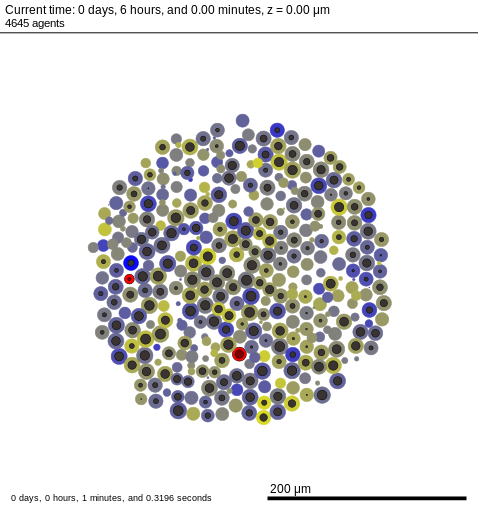

# Getting started with PhysiCell-X

PhysiCell-X constitutes a new development branch created from the original PhysiCell tool, whose objective focuses on expanding its capabilities to use distributed computing. This approach allows the tool to run simultaneously on different nodes, and therefore, being able to combine their resources as a single machine, which is crucial for simulating biological scenarios where memory requirements exceed the available capacity of the individual machines. To this end, PhysiCell-X extends the official OpenMP-based version to an OpenMP + MPI (Message Passing Interface) solution, where MPI provides the particular mechanism to efficiently distribute the computational load between the different connected nodes. Hence, users could expand their cellular simulations to include a larger number of cells, substrates or molecular pathways.

In this tutorial, we will explore PhysiCell-X’s capabilities to run simulations in parallel. In particular, we will leverage the different cores that a single machine could have, and subsequently, the different nodes available at a supercomputer such as MN4.

## Installing the code

To start the installation, the user must download the PhysiCell-X source code from this repository (https://gitlab.bsc.es/gsaxena/physicell_x). The project can be either cloned or downloaded in zip format, where the user will need to unzip the file in order to proceed with the installation.
Due to the fact that PhysiCell-X has minimal requirements (limiting the incorporation of third-party-libraries), its installation becomes very easy for the user. One of the few requirements in this specific release is the installation of the openMPI libraries, in order to properly compile the code and, in execution time,  to manage simulations that require more than one computing node.

## Compiling the code

PhysiCell-X has a number of use cases to provide the user with examples to guide them through the process of designing their own simulations. The available use cases can be listed using the following command. 

```
> make list-projects
```

```
Sample projects: template biorobots-sample cancer-biorobots-sample cancer-immune-sample
                 celltypes3-sample heterogeneity-sample pred-prey-farmer virus-macrophage-sample worm-sample

Sample intracellular projects: ode-energy-sample physiboss-cell-lines-sample cancer-metabolism-sample
```

For this tutorial, we will focus on the "heterogeneity-sample" example, which deals with the simulation of a heterogeneous population of tumour cells.
In order to compile the example, we use the following commands:

```
> make heterogeneity-sample
> make
```

After compilation, we should see an executable created in the same folder and called "heterogeneity". This binary allows us to run the example, having "results" as the default output folder. But before running the example, we should take a look at the configuration file config/PhysiCell_settings.xml.

```
> vim config/PhysiCell_settings.xml
```

```
…
        <overall>
                <max_time units="min">64800</max_time>
                <time_units>min</time_units>
                <space_units>micron</space_units>
                <dt_diffusion units="min">0.01</dt_diffusion>
                <dt_mechanics units="min">0.1</dt_mechanics>
                <dt_phenotype units="min">6</dt_phenotype>
        </overall>
…
```

By editing this file we can set most of the essential parameters in a PhysiCell-X’s execution, such as the simulation time, the voxel size or the diffusion coefficients, among others (for more details check documentation/User_Guide.pdf
). Also, apart from these general parameters, the users could define their own features that will make sense in their particular simulations.

## Running the example

To run the heterogeneity-sample project we just have to execute the binary

```
> ./heterogeneity
```


After starting the simulation, the user can see the course of the simulation through the log messages emitted to the standard output. In addition, a set of output files describing the main characteristics of each cell, as well as the density of each of the substrates along the physical space used in the simulation, will be progressively generated in the results folder.  These files are created by using  the  MultiCellDS standard format, composed mainly of an .m file and an xml file (see for more information http://www.mathcancer.org/blog/working-with-physicell-snapshots-in-matlab/). In addition, PhysiCell-X additionally stores a series of SVG files that graphically describe the position of each of the simulated cells, of great interest when the user needs to generate movies to visualize the full course of the simulation.





## Working on a cluster

In order to use the full computational capabilities of PhysiCell-X in a professional HPC environments, it is recommended to run PhysiCell-X through a queuing system, such as Slurm.  This approach allows HPC facilities to efficiently manage the available computational resources, usually shared between different users. 
If we want to launch a PhysiCell-X execution with Slurm, we will first need to create the corresponding batch file, where the user usually defines the specific resources that are required to properly run the simulation. To do this, we can create the file as follows:

```
> vim batch_test
```


```
#!/bin/bash
#SBATCH -n 4
#SBATCH -t 60:00
#SBATCH -J test
#SBATCH -o test.out
#SBATCH -e test.err
#SBATCH -D .

./heterogeneity
```


In this case, we are requiring a node with 4 cores, with a maximum of execution of 60 minutes, having as standard and error output files "test.out" and "test.err" respectively. Once created, we can finally send the job by using the “sbatch” command.

```
> sbatch batch_test
```

Then, we can check the status of the simulation by using the following command.

```
> squeue
```


The PhysiCell-X tool integrates MPI technologies to implement distributed computing. In this case, we have to include additional fields into our batch test file to run the simulation as a MPI execution.

```
> vim batch_mpi_test
```

```
#!/bin/bash
#SBATCH --nodes=2
#SBATCH --ntasks-per-node=1
#SBATCH --cpus-per-task=4
#sbatch -J test_mpi
#SBATCH -t 60:00:00
#SBATCH -o test_mpi.out
#SBATCH -e test_mpi.err
#SBATCH --exclusive

mpiexec --map-by ppr:1:node:pe=4 ./heterogeneity
```

Once created, we can finally send the job:

```
> sbatch batch_mpi_test
```


## How to continue learning

The following links redirect the users to interesting tutorials where they can learn how to design a simulation with PhysiCell’ ecosystem tools.


- [Building and running the standard PhysiCell sample projects](http://www.mathcancer.org/blog/physicell-sample-projects/)
- [Loading and viewing PhysiCell digital snapshots in Matlab](http://www.mathcancer.org/blog/working-with-physicell-snapshots-in-matlab/)
- [User-defined model parameters in PhysiCell XML configuration files](http://www.mathcancer.org/blog/user-parameters-in-physicell/)
- [Setting up the microenvironment with the XML configuration file](http://mathcancer.org/blog/setting-up-the-physicell-microenvironment-with-xml)


<br>
<br>


